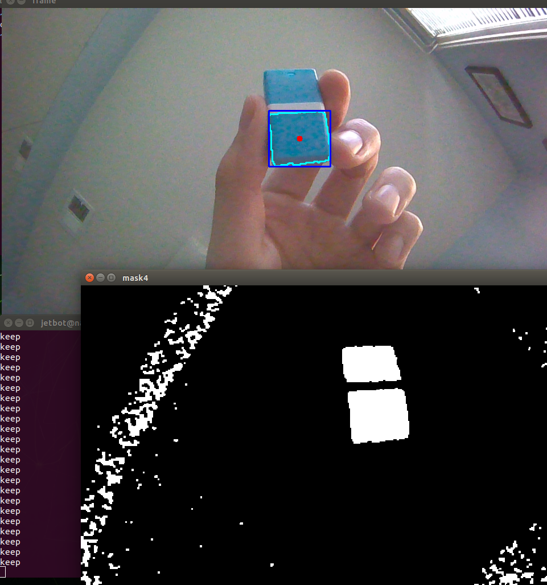
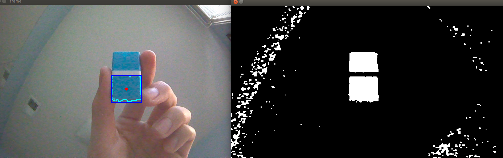
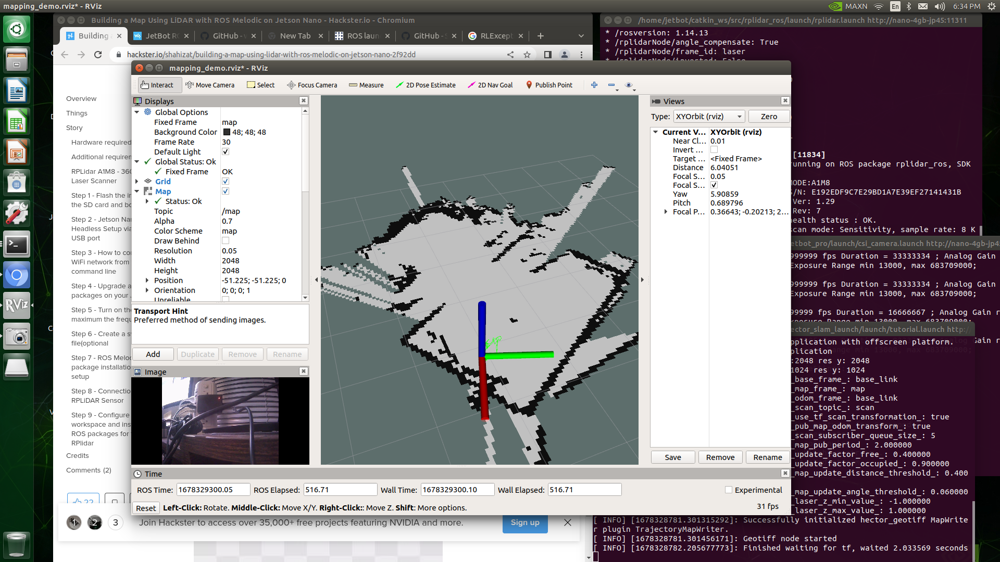

# Exploring Computer Vision and Deep Learning with a Nvidia Jetson Robot


**Author:** Youxin Zhuo ([SmashCodeJJ](https://github.com/SmashCodeJJ))  
**Education:** B.S., Pennsylvania State University · Graduate Student, University of Pennsylvania (UPenn)  
**Institution:** Penn State University (undergraduate project)  
**Platform:** NVIDIA Jetson Nano · JetBot · ROS · PyTorch · OpenCV · TensorRT

---

## Overview

This research explores computer vision and deep learning on an NVIDIA Jetson Nano mobile robot. The work evaluates the Jetson platform as a teaching tool for a future robotic AI course and covers performance benchmarking, real-time object detection, collision avoidance, and color tracking using ROS motor control.

## Sub-Projects

| Project | Description | Key Technologies |
|---------|-------------|------------------|
| **CPU vs GPU Benchmark** | Compared neural network inference speed on CPU vs GPU | PyTorch, Jetson CUDA |
| **YOLOv5 + TensorRT** | Optimized real-time object detection with TensorRT | YOLOv5, TensorRT, DeepStream |
| **Collision Avoidance** | Robot navigates a circular table, avoiding obstacles | ResNet18, PyTorch, JetBot |
| **Color Tracking** | Tracks a colored object and steers the robot via ROS | OpenCV, HSV, ROS |

---

## Results

### CPU vs GPU Performance

Running a neural network on the Jetson Nano GPU is significantly faster than on CPU. GPU acceleration is essential for real-time robotic vision workloads on embedded hardware.

**Verified benchmark (ResNet50, batch=32):**

| Device | Avg Batch Time | Notes |
|--------|----------------|-------|
| CPU | 3314 ms | Mac re-run (Aug 2026) |
| GPU/MPS | 195 ms | **17x speedup** vs CPU |

> Original Jetson Nano measurements used CUDA on embedded GPU. Relative speedup confirms GPU acceleration is critical for real-time inference.

Run locally: `python scripts/run_cpu_gpu_benchmark.py` → saves `results/cpu_gpu_benchmark.json`

### YOLOv5 Object Detection — GPU vs TensorRT

| Configuration | FPS |
|---------------|-----|
| GPU (CUDA) | **6.5** |
| GPU + TensorRT optimization | **13.35** |

TensorRT approximately **doubled** inference throughput compared to raw GPU execution.


### Color Tracking

OpenCV-based HSV color detection with morphological filtering, contour analysis, and ROS motor commands to center the target in the camera view.

<p align="center">
  
  
</p>

### LIDAR Mapping



---

## Collision Avoidance

A custom PyTorch classifier distinguishes **Free** vs **Block** space using the robot camera.

**Pipeline:**
1. Collected 50 images each for `Free` and `Block` classes
2. Preprocessed images (resize, normalize, tensor conversion)
3. Fine-tuned **ResNet18** (pre-trained) for binary classification
4. Trained for 30 epochs with train/test evaluation each iteration
5. Integrated the model with JetBot motor control for autonomous navigation

When the camera detects an obstacle (`Block`), the robot turns; in open space (`Free`), it moves forward.

> Collision avoidance notebooks are included in [`notebooks/collision_avoidance/`](notebooks/collision_avoidance/) (data collection, ResNet18 training, live demo, TensorRT build).

---

## Repository Structure

```
Jetson-Nano/
├── README.md
├── CPU vs GPU vs Tensorrt.ipynb       # Original Jetson benchmark notebook
├── color_detection.py                 # OpenCV color tracking (Jetson CSI camera)
├── object_tracking.py                 # Color tracking + ROS motor control
├── scripts/
│   ├── run_cpu_gpu_benchmark.py       # Reproducible CPU vs GPU benchmark
│   └── demo_color_detection.py        # Mac/PC demo using sample image
├── notebooks/collision_avoidance/     # Full collision avoidance pipeline
├── docs/                              # Additional project screenshots
├── results/                           # Generated benchmark outputs
├── Install_Yolov5_JetsonNano
├── Yolov5_Tensorrt_JetsonNano
└── *.png                              # Result screenshots
```

---

## Hardware & Software Requirements

- **Hardware:** NVIDIA Jetson Nano, JetBot kit, CSI camera (IMX219)
- **OS:** JetPack 4.5 (JetBot 0.4.3 SD image)
- **Software:** Python 3.6+, PyTorch 1.8, Torchvision 0.9, OpenCV, ROS, CUDA 10.2

---

## Getting Started

### 1. Flash JetBot SD Image

Follow the official [JetBot SD card setup](https://jetbot.org/master/software_setup/sd_card.html).

### 2. Install YOLOv5

See [`Install_Yolov5_JetsonNano`](Install_Yolov5_JetsonNano) for step-by-step installation on Jetpack 4.5.

### 3. Optimize with TensorRT

See [`Yolov5_Tensorrt_JetsonNano`](Yolov5_Tensorrt_JetsonNano) for converting YOLOv5 to TensorRT via DeepStream.

### 4. Run Color Tracking

```bash
# Standalone OpenCV demo
python3 color_detection.py

# With ROS motor control (requires ROS + JetBot motors node)
python3 object_tracking.py
```

### 5. Collision Avoidance Training

Open the collision avoidance notebooks in the JetBot examples:

```bash
cd ../jetbot/notebooks/collision_avoidance/
jupyter notebook train_model_resnet18.ipynb
```

---

## Key Learnings

- **Embedded GPU matters:** Jetson Nano GPU delivers meaningful speedups for deep learning inference vs CPU-only execution.
- **TensorRT optimization:** Converting models to TensorRT engines can ~2× FPS for production deployment.
- **Transfer learning works on small datasets:** ResNet18 fine-tuned on 100 total images achieved reliable collision avoidance.
- **ROS integration:** Combining OpenCV vision pipelines with ROS motor nodes enables closed-loop robot control.

---

## References

- [JetBot Official Documentation](https://jetbot.org/)
- [NVIDIA TensorRT](https://developer.nvidia.com/tensorrt)
- [Ultralytics YOLOv5](https://github.com/ultralytics/yolov5)
- [Setting up Jetson Nano: Jetpack to YOLOv5](https://sahilchachra.medium.com/setting-up-nvidias-jetson-nano-from-jetpack-to-yolov5-60a004bf48bc)

---

## License

Academic research project — Penn State University. JetBot components are subject to [NVIDIA JetBot license](https://github.com/NVIDIA-AI-IOT/jetbot).
